# 3. Projeto de Interface

## 3.1 Wireframes

Wireframes são protótipos simples que representam a estrutura e o layout básico de um site ou aplicação web, destacando os elementos essenciais da interface e a organização das páginas.

## Wireframes por Tela

### Tela - 1 - Tela inicial e login

O 1º login é cadastrado como administrador, próximos logins são controlados pelo administrados dentro da plataforma.

- Texto motivador da plataforma
- Login

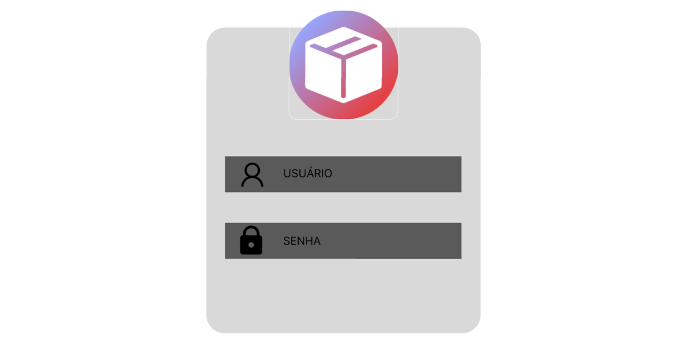

### Tela - 2 - Dashboard inicial

Visão resumida dos itens, informações importantes como validades, baixo estoque, gráficos de movimentação ...

- Saldo entrada/saida
- Ultimas transações
- Alertas (Validade, Estoque Baixo)

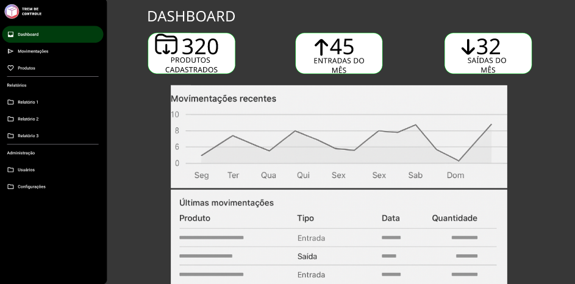
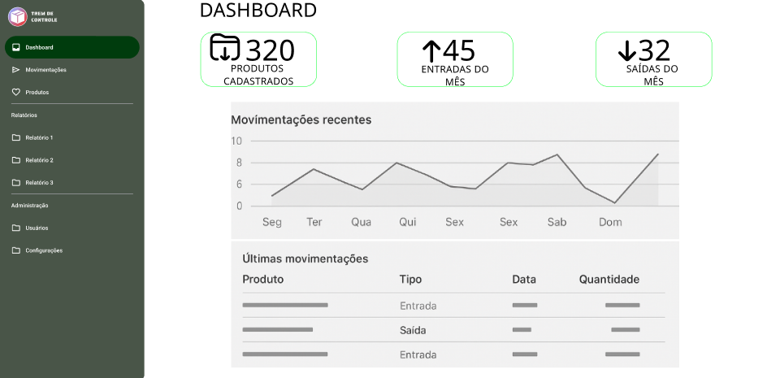

### Tela - 3 - Operações diárias

Registro de transações: Compras/Vendas/Uso Interno, histórico recente de alterações.

- Histórico de transações/movimentações
- Campos para registrar novas movimentações
- Campo de pesquisa de produtos

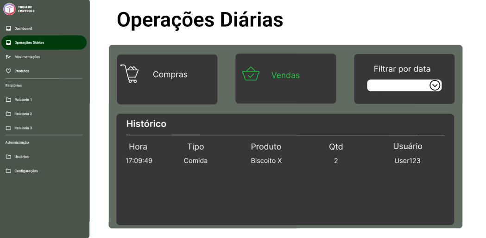

### Tela - 4 - Catálogo de Produtos e Pesquisa

Lista de items cadastrados com informações breves (Ex: Fotos, item, sku, quantidade, entrada saída, Filtros, pesquisa por código, descrição, ...).

- Barra de pesquisa com filtros
- Lista de produtos com informações mais importantes

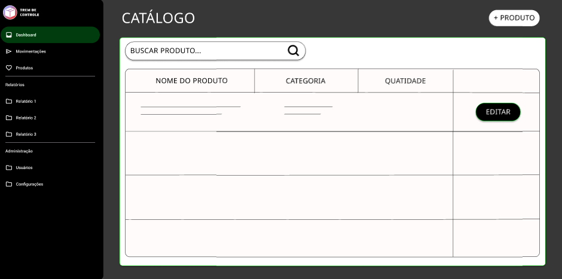
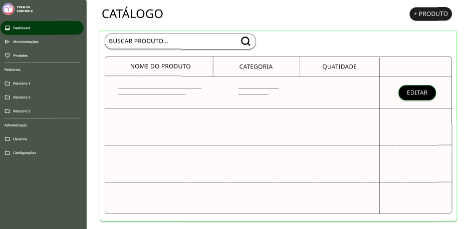

### Tela - 5 - Cadastro e Alteração de Produtos

CRUD de produtos e informações.

- Página de alteração do protudo (formulário)

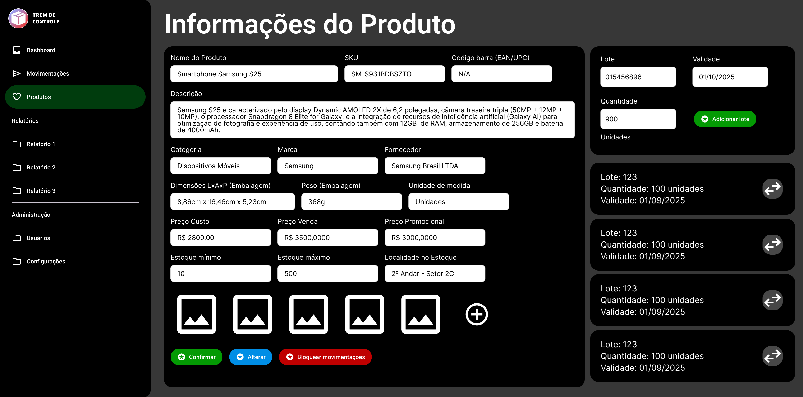
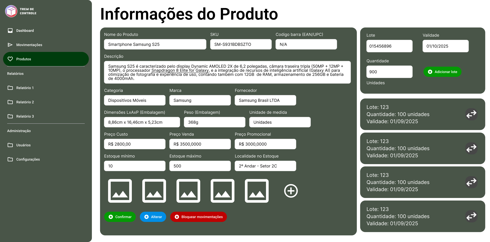

### Tela - 6 - Administrativo - Cadastro de Usuários

Apenas para admins, Cadastro e edição de usuários na plataforma.

- Lista de usuários cadastrados
- Campo de alteração das informações de usuário

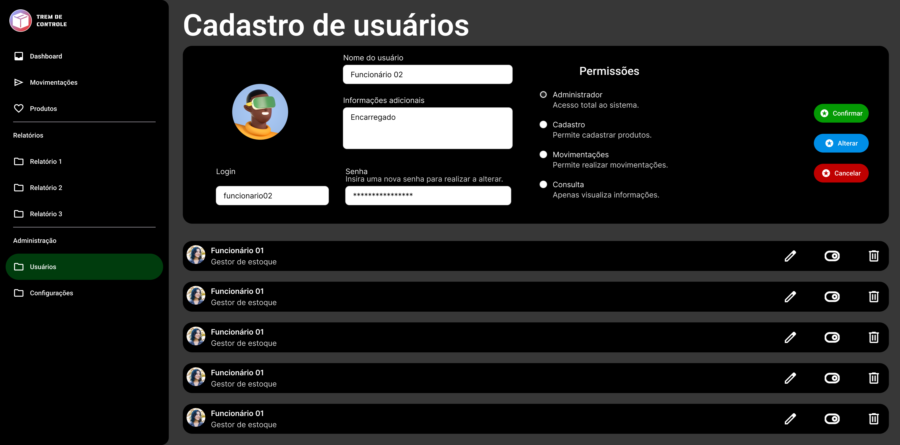
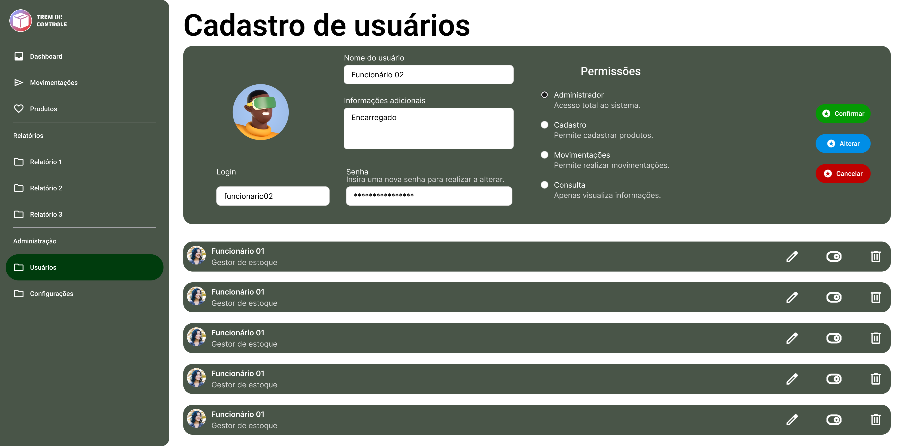

### Tela - 7 - Administrativo - Configurações

Altera configurações do funcionamento do sistema.

- Alterar informações da empresa (Nome, CNPJ, ...)
- Altarar informações como moeda, tema, padrões de medidas, ...

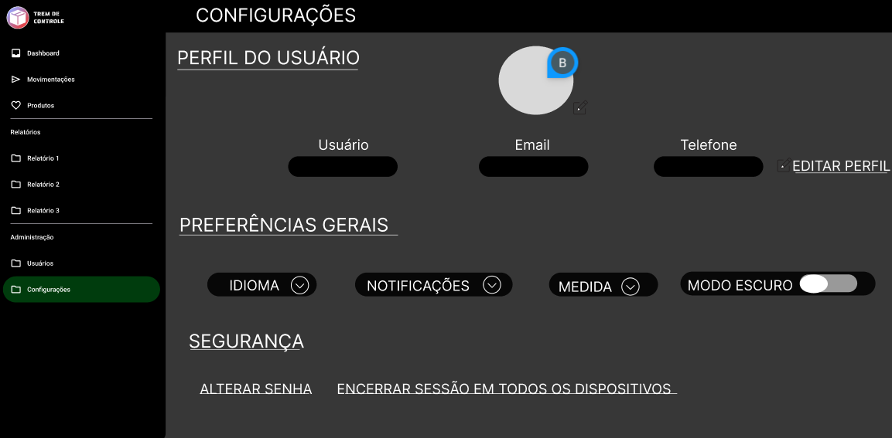
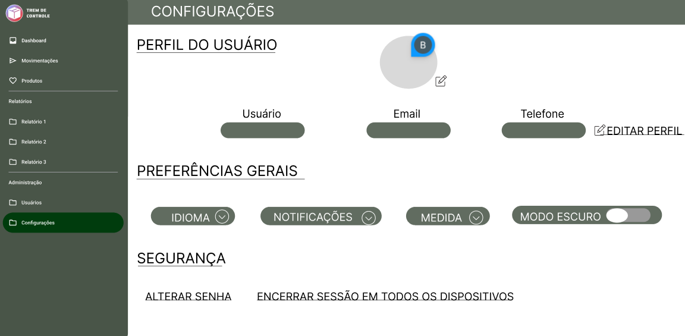

### Tela - 8 - Histórico de Operações

Operações realizadas no sistema.

- Lista de operações realizadas como alterações de configuração, entrada/saida, alterações nos cadastro de itens.

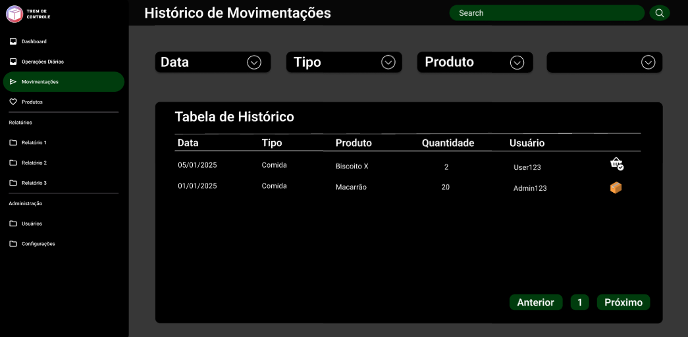
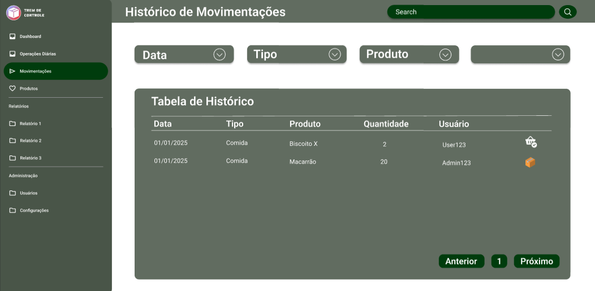

### Tela - 9 - Relatórios

Template para relatórios diversos

- Graficos
- Informações gerais

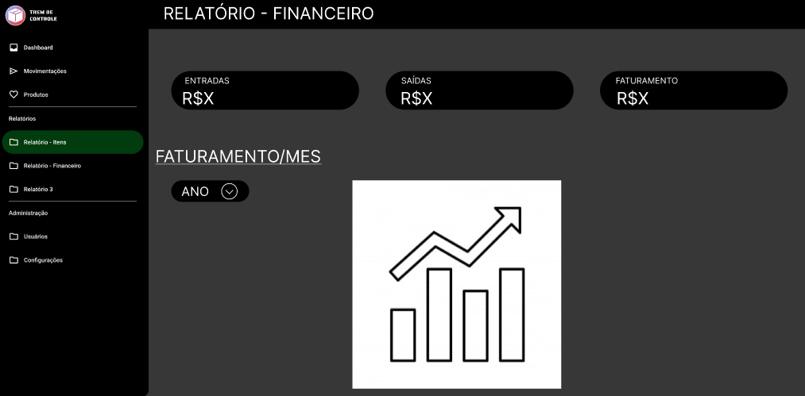
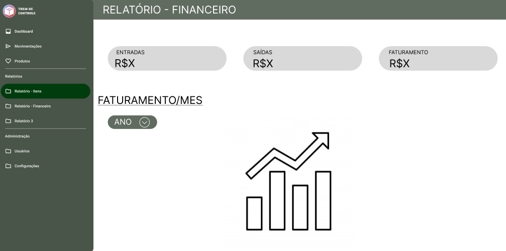
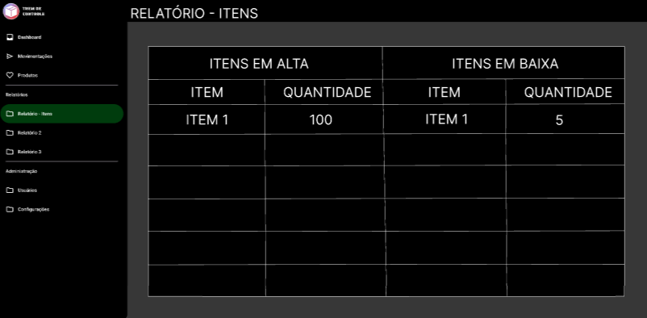
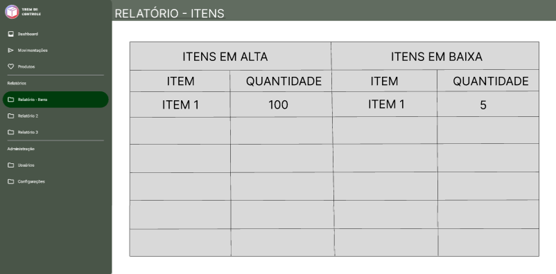
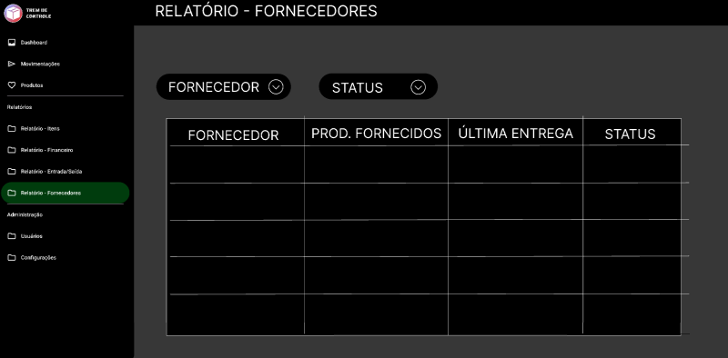

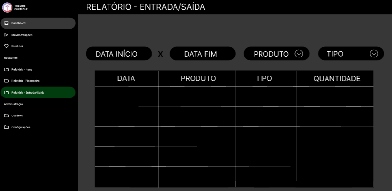

## Fluxo de Usuário (User Flow)

O fluxo de usuário (User Flow) é um mapeamento de todo fluxo de telas do site ou app.

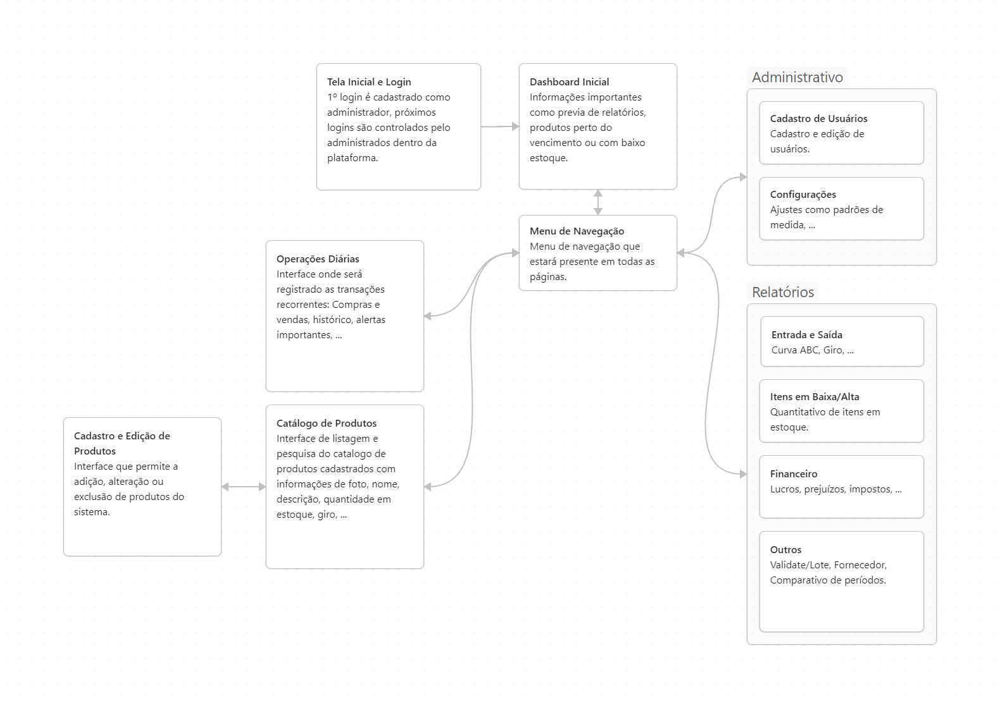
