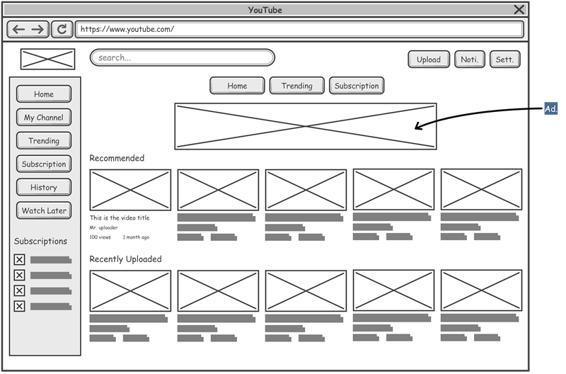

# 3. Projeto de Interface

**Pré-requisitos:** [Documentação de Especificação](2-Especificação.md)

Nesta seção, apresente as principais telas da plataforma e explique como a interface foi elaborada para atender aos requisitos funcionais, requisitos não funcionais e histórias de usuário definidos na Especificação do Projeto.

## 3.1 Wireframes

### O que são wireframes?

Wireframes são protótipos simples que representam a estrutura e o layout básico de um site ou aplicação web, destacando os elementos essenciais da interface e a organização das páginas.

### Exemplo de Wireframes

🗑️ _[Esta seção deve ser apagada e substituída pelos seus exemplos de wireframes ou mockups]_

## Wireframes por Tela

### Tela 1 – Login

- Descrição breve da tela e sua função  
- Como atende aos requisitos (ex: segurança no login, usabilidade, etc.)  
- (Imagem)

### Tela 2 – Página Principal

- Descrição breve da tela e sua função  
- Relação com requisitos funcionais (ex: exibe produtos, permite busca, etc.)  
- (Imagem)

### Tela 3 – Carrinho de Compras

- Descrição breve da tela e sua função  
- Considerações sobre usabilidade, feedback ao usuário, etc.  
- (Imagem)

### Tela 4 – [colocar o nome]

### Tela x – [colocar o nome]

...

> **Links Úteis**:
>
> - [Ferramentas de Wireframes](https://rockcontent.com/blog/wireframes/)
> - [MarvelApp](https://marvelapp.com/developers/documentation/tutorials/)
> - [Balsamiq](https://balsamiq.com/)
