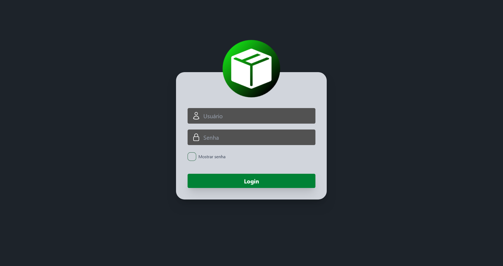
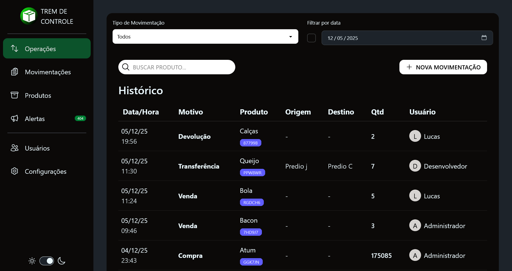
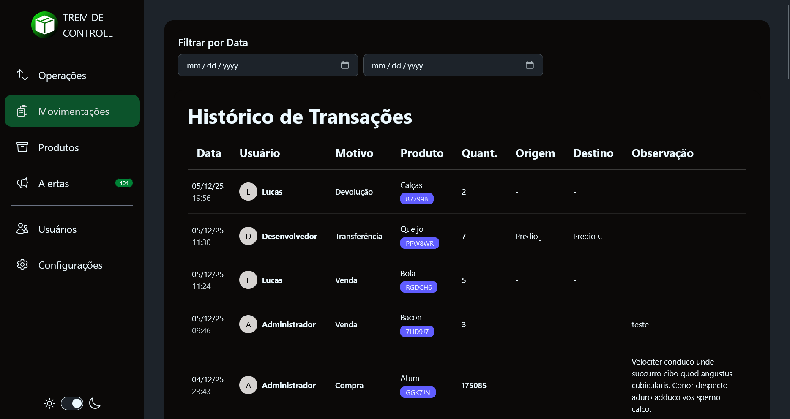
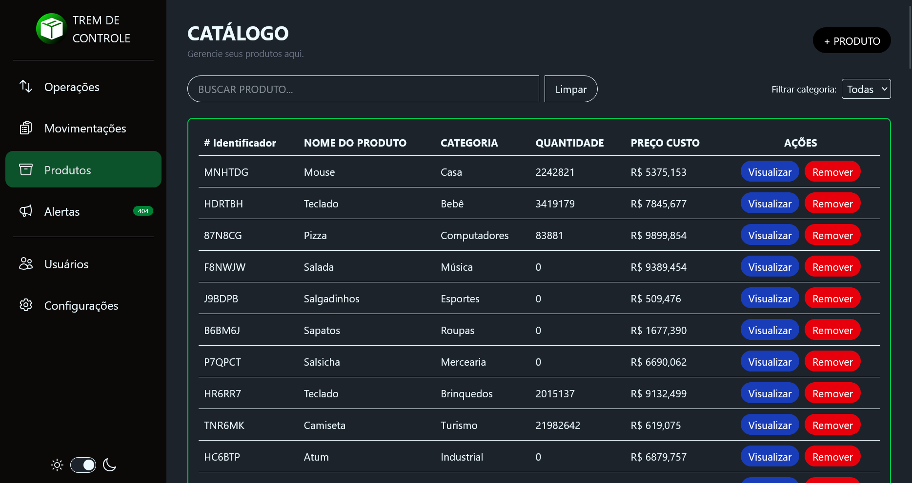
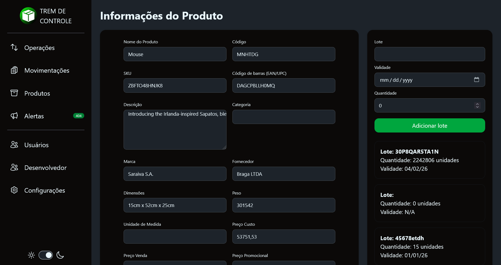
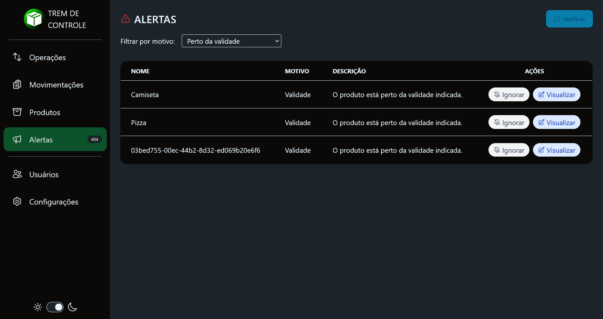
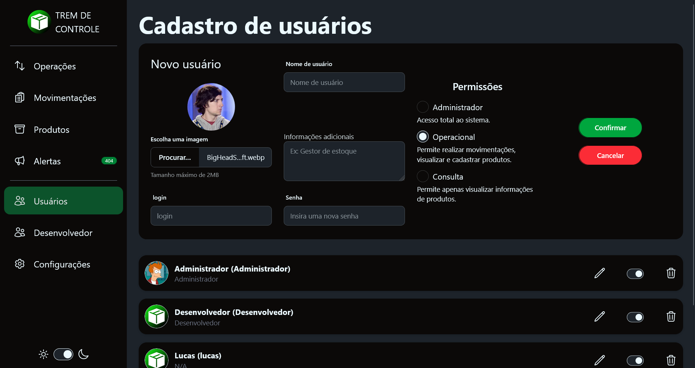
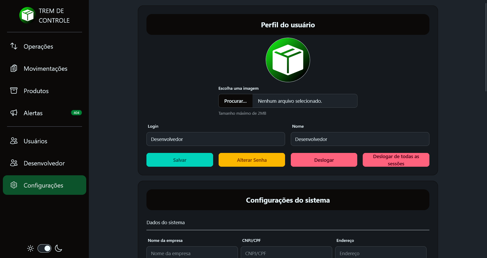

# 5. Projeto da Solução

## 5.1 Tecnologias Utilizadas

| Categoria             | Tecnologia/Ferramenta | Justificativa de uso |
|-----------------------|------------------------|----------------------|
| Linguagem             | TypeScript (Bun/Node.Js)             | Implementação das funcionalidades do front-end e back-end. |
| Framework Front-end   | Vue.js               | Criação de interfaces dinâmicas e reutilizáveis. |
| Banco de Dados        | SQLite + DrizzleORM                  | Armazenamento e gerenciamento de dados. |
| Ferramenta de Design  | Figma                  | Criação de protótipos e wireframes. |
| IDE                   | VS Code                | Ambiente principal de desenvolvimento. |

---

## 5.2 Acompanhamento das Interfaces do Sistema

### 📋 Quadro de Progresso das Telas

| Requisito/Tela                | Status | Última atualização | Próxima entrega |
|--------------------------------|--------|--------------------|-----------------|
| Tela de Login                 | 🟢 Concluída    | N/A         | N/A      |
| Tela de Operações                 | 🟢 Concluída    | N/A         | N/A      |
| Tela de Histórico de Movimentações | 🟢 Concluída    | N/A         | N/A      |
| Tela de Catálogo de Produtos                 | 🟢 Concluída    | N/A         | N/A      |
| Tela de Informações do Produto                 | 🟢 Concluída    | N/A         | N/A      |
| Tela de Alertas                 | 🟢 Concluída    | N/A         | N/A      |
| Tela de Cadastro de Usuário                 | 🟢 Concluída    | N/A         | N/A      |
| Tela de Configurações do Sistema                 | 🟢 Concluída    | N/A         | N/A      |

Legenda: 🟢 Concluído | 🟡 Em andamento | 🔴 Não iniciado

---

### 5.3 Registro Visual das Telas

#### 5.3.1 Tela de login

**Descrição:** Página de login

#### 5.3.2 Tela de Operações

**Descrição:** Página de operações diárias para registro de movimentações.

#### 5.3.3 Histórico de movimentações

**Descrição:** Página com registro de movimentações.

#### 5.3.4 Catálogo de produtos

#### 5.3.5 Informações do Produto

**Descrição:** Página de cadastro/edição/visualização das informações do produto.

#### 5.3.5 Alertas

**Descrição:** Alertas de quantidade min. e max, validade.

#### 5.3.5 Cadastro de usuários

#### 5.3.6 Configurações de usuário e sistema

